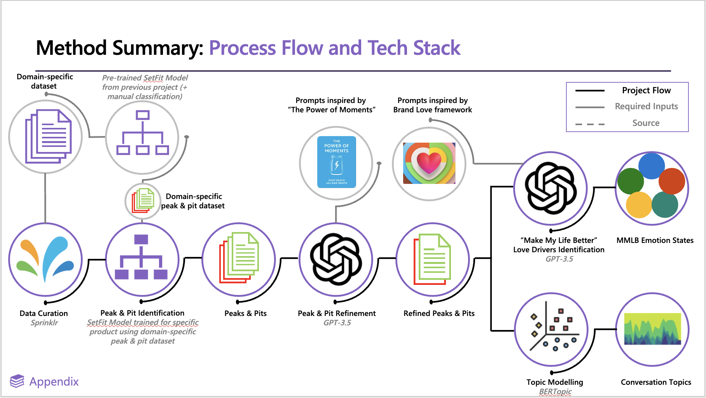

# High-level overview {#high-level-overview} 

## Core steps of a peaks and project

Peaks and pits have gone through many iterations throughout the past year and a half. Currently, the general workflow is

1. [Extract brand/product mentions from Sprinklr (the start of any project)](#step-one)
2. [Classify a sample of posts (of each sentiment) using GPT-3.5 **OR** one of the latest SetFit model that has been developed (e.g. the one from the previous project) to quickly identify peaks and pits](#step-two)
3. [Human review to select exemplar peaks and pits from these 'crudely identified posts'](#step-three)
4. [Fine-tune the SetFit model using selected exemplar posts (from current project and previous projects)](#step-four)
5. [Run inference of this fine-tuned model over all of the project specific data](#step-five)
6. [Use GPT-3.5 for an extra layer of classification on identified peaks and pits](#step-six)
7. [Further understanding the identified peak and pit moments](#step-seven)
    - 7.a. [Conduct topic modelling via BERTopic over peaks and pits separately to identify high level topics for each brand x peak/pit](#step-seven-a)
    - 7.b. [Utilize GPT-3.5 for multilabel classification of Brand Love Emotion States in peak and pit posts](#step-seven-b)

```{r, fig.cap = "Schematic workflow from Project 706", echo = FALSE, out.width = '100%'}

```
