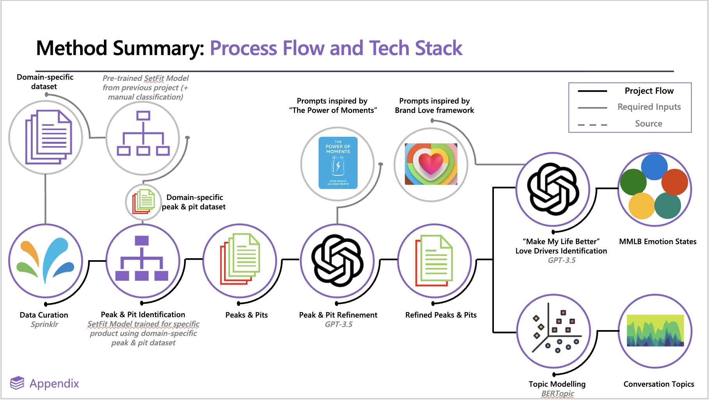

# High-level overview {#high-level-overview} 

## Core steps of a peaks and project

Peaks and pits have gone through many iterations throughout the past year and a half. Currently, the general workflow is

1. [Extract brand/product mentions from Sprinklr (the start of any project)](#step-one)
2. [Classify a sample of ~600 posts per brand (~200 'positive' and ~200 'negative' and ~200 'neutral' posts) using the *latest* SetFit model that has been developed (i.e. the one from the previous project) OR GPT-3.5 to quickly/speedily identify peaks and pits](#step-two)
3. [Human review to select exemplar peaks and pits from these 'crudely identified posts'](#step-three)
4. [Fine-tune the SetFit model using selected exemplar posts (from current project and previous projects)](#step-four)
5. [Run inference of this fine-tuned model over all of the project specific data](#step-five)
6. [Use GPT-3.5 for an extra layer of classification on identified peaks and pits](#step-six)
7.a [Conduct topic modelling via BERTopic over peaks and pits separately to identify high level topics for each brand x peak/pit](#step-seven)
7.b [Utilize GPT-3.5 for multilabel classification of Brand Love Emotion States in peak and pit posts](#step-eight)

(\#fig:unnamed-chunk-1)Schematic workflow from Project 706

