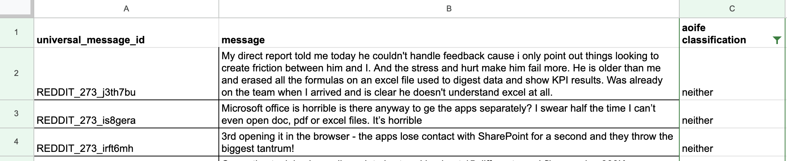

# Step 3: The human touch- find the exemplars {#step-three}

Irrespective of the approach used in the [previous step](#killer-examples), Step 3 requires us to read the sample of peaks and pits identified using human reasoning to find exemplar posts.

These should be saved in a Google Sheet, with one tab/worksheet per product and classification (i.e. `productA_peak`; `productA_pit`; `productB_peak`; `productB_pit` and individually classified by eye as below:

```{r, fig.cap = "Example Google Sheet", echo = FALSE}

```

The key here is to be consistent in our labelling. The issue with classifications such as sentiment and peaks and pits is that they are inherently subjective - how we label posts will be influenced by the data labeller's personal experiences, expertise, cultural lenses etc. We therefore must mitigate this level of subjectivity as much as possible, namely by 1) having a clear definition/structure for labelling, 2) label consensus, 3) label auditing. 

For 1), a for a post to be defined as a peak or a pit (for the purpose of data labelling) it must tick all of the following:

* Have clear brand/product attribution. 
* (For Peak) Relate to a significant memorable experience where brand/product deliveries exceptional value.
* (For Pit) A significant negative experience that creates a lasting memory.
* NOT just be general negative or positive sentiment.
* NOT contain both a peak and a pit moment.

We must remember here that more is not better, it is much better to have fewer labelled data that is of higher quality than more data that might confused our classifier. 


A Peak moment is not just a positive comment but a significant, memorable experience where brands or products delivers exceptional value, creating a lasting memory. A Pit moment is not merely a negative comment but a significant, negative brand experience with brands or products that creates a lasting memory. Posts with general positive or negative sentiments that do not constitute these memorable experiences should be classified as 'Neither'.


Depending on the resources available, these posts should be cross-checked by another person blindly (i.e. not seeing what each of you has labelled the post). The posts that both of you agree on are those that should go to the next step. It is important here to also include posts that are neither peak or pit, and label these as 'neither'. This should be a mixture of clearly 'neither' posts such as spam, or posts of neutral sentiment, but also it is useful to include posts that display clear sentiment *but do not qualify as a peak or a pit*. These examples will be difficult for the model but are important to ensure we are not simply producing a glorified sentiment classification model. 

> It is worth making a note of these 'difficult' neither posts (i.e. those with sentiment), as it is useful to track these throughout the next steps to see whether the model particularly struggles with them or not.

