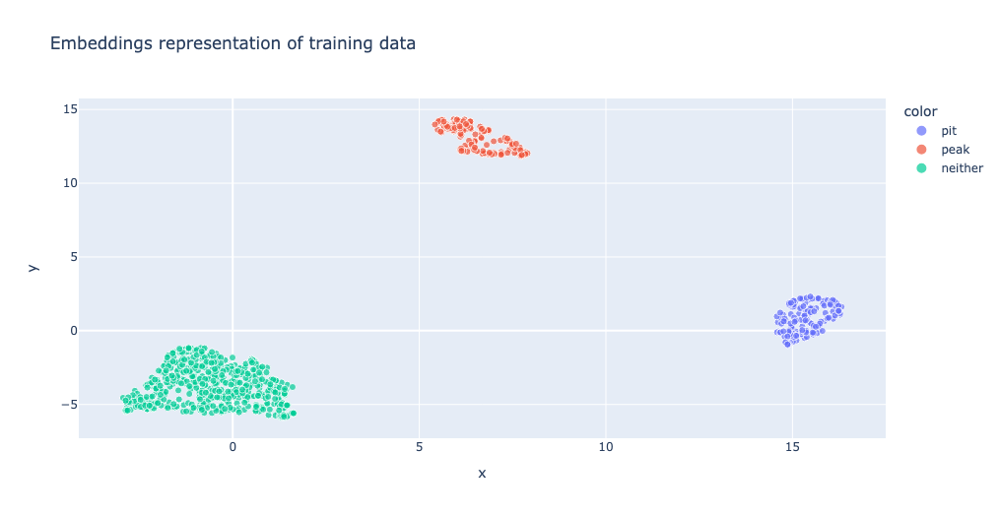
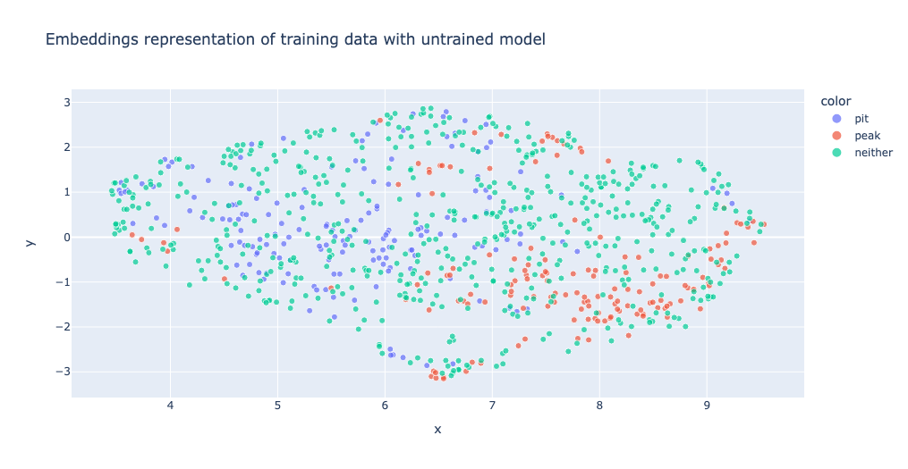

# Fine-tune the SetFit model (Step 4) {#step-four}

The [SetFit documentation](https://huggingface.co/docs/setfit/index) provides a really nice overview of what SetFit actually is behind the scenes (very DS heavy, so analysts do not worry about understanding all of this) why this approach is suitable, and how to implement it.

Before training the SetFit model on our data we need to do some cleaning/wrangling on our fine-tuning datasets. Namely, we need to mask mentions of brand/product entities to avoid introducing bias- for example if a particular brand is predominantly mentioned in peak contexts in the training data, the model might learn to associate peak moments with that brand rather than learning the peak-language expressed in the text.

To do this, we use the a model based on Facebook's RoBERTa model, `xlm-roberta-large-finetuned-conll03-english`, to perform NER recognition, and then mask the ORG and MISC entities using a `rivendell` function `ner_brand_product()` in R.

```
!pip install datasets
!pip install transformers
import pandas as pd
from transformers import pipeline
from datasets import Dataset

# Load in dataset
input_df = pd.read_csv("path/to/sample/data/filename.csv")

# NER pipeline initialization
ner = pipeline("ner", model="xlm-roberta-large-finetuned-conll03-english", device=0, aggregation_strategy="simple")

# Convert DataFrame to Dataset
dataset = Dataset.from_pandas(input_df)

# Run NER on the 'message_og' column
results = ner(dataset["message_og"])

# Convert results to DataFrame
results_df = pd.DataFrame(results)

# Append 'universal_message_id' column from input_df to results_df
results_df['universal_message_id'] = input_df['universal_message_id']

# Save the modified results_df to a CSV file
results_df.to_csv("ner_results.csv", index=False)
```


We can then use an additional couple of `rivendell` functions (`pp_brands()` and `pp_products()`) to mask specific brands and products from previous projects, before doing some *very* high level data cleaning- namely removing hashtags, mentions, URLs and emojis. We don't want to do too much data cleaning because SetFit is based on embeddings, so keeping stop words, punctuation etc is needed to maintain semantic meaning in each post.

```
ner_clean <- rivendell::ner_brand_product(ner_df = ner_results,
                                          input_df = input_df,
                                          text_var = text_var)

output_df <- input_df %>%
  mutate(setfit_text = message_og,
         setfit_text = ifelse(!is.na(ner_clean$replacement_text),
                              ner_clean$replacement_text, message_og)) %>%
  rivendell::pp_brands(text_var = setfit_text) %>%
  rivendell::pp_products(text_var = setfit_text) %>%
  ParseR::clean_text(text_var = setfit_text,
                     hashtags = FALSE,
                     mentions = FALSE,
                     emojis = FALSE, 
                     punctuation = TRUE,
                     digits = TRUE,
                     in_parallel = TRUE)
```

At this step, we can split out our data into training, testing, and validation datasets. A good rule of thumb is to split the data 70% to training data, 15% to testing data, and 15% to validation data. By default, [SetFit oversamples](https://huggingface.co/docs/setfit/v1.0.3/en/conceptual_guides/sampling_strategies) the minimum class within the training data, so we shouldn't have to worry about imbalanced datasets. Indeed, our (Jamie and Aoife) experimentation has shown that class imbalance doesn't seem to have a significant effect to the training/output of the SetFit model for peaks and pits.

We are now at the stage where we can actually fine-tune the model. The key parameters that seem to make a difference to SetFit are:

* The specific sentence transformer (ST) model used
* Number of epochs
* Number of sequence-pair generation iterations

so it is worthwhile fine-tuning a few models with different hyperparameter values for these such as:

* Trying `paraphrase-mpnet-base-v2` or `all-mpnet-vase-v2`
* Epochs (1 or 2)
* Iterations (5, 10, 20, 30)

But try not to get to get stuck in the weeds here! 

> **The perfect is the enemy of the good**

We can access model performance on the testing dataset by looking at accuracy, precision, recall, and F1 scores. For peaks and pits, the most important metric is actually **recall** because in [step 6](#gpt35-inference) we reclassify posts using GPT, so we want to make sure we are able to provide *as many true peak/pit moments as possible* to this step, even if it means we also provide a few false positives.

```
# Load a SetFit model from Hub
model = SetFitModel.from_pretrained("sentence-transformers/paraphrase-mpnet-base-v2")

from sklearn.metrics import precision_recall_fscore_support, accuracy_score

def compute_metrics(pred, label):
    precision, recall, f1, _ = precision_recall_fscore_support(y_true = label, y_pred = pred, average=None)
    acc = accuracy_score(label, pred)
    return {
    'accuracy': acc,
    'f1': f1,
    'precision': precision,
    'recall': recall
    }
    
# Create trainer
trainer = SetFitTrainer(
    model=model,
    train_dataset=train_ds,
    eval_dataset=test_ds,
    loss_class=CosineSimilarityLoss,
    metric=compute_metrics,
    batch_size=4,
    num_iterations=20, # The number of text pairs to generate for contrastive learning
    num_epochs=1, # The number of epochs to use for constrastive learning
    column_mapping={"masked_context": "text", "label": "label"} # Map dataset columns to text/label expected by trainer
)

# Train and evaluate
trainer.train()

metrics = trainer.evaluate()
metrics
```

A bonus that can be done to check how well our model is able to separate the different classes in embedding space, is to visualise the 2-D structure of the embeddings and see how they cluster:

```
from sklearn.preprocessing import MinMaxScaler
from umap import UMAP
import pandas as pd
import plotly.express as px

def print_2d_embeddings_per_epoch(embeddings, labels, title="Embeddings representation in last epoch"):
  X_scaled = MinMaxScaler().fit_transform(embeddings)
  umap_2d_components = UMAP(n_components=2, metric="cosine").fit(X_scaled).embedding_

  result_2d = pd.DataFrame(umap_2d_components, columns=['x', 'y'])
  result_2d['labels'] = labels

  fig = px.scatter(
    result_2d, x='x', y='y', color=labels,
    size=[1]*len(embeddings), size_max=5, title=title

    )

  fig.update_traces(mode="markers", selector=dict(type='scatter2d'))
  fig.show()

print_2d_embeddings_per_epoch(embeddings1, train_ds["label_text"], "Embeddings representation of training data")
```

```{r, fig.cap = "Trained embedding model", echo = FALSE, out.width="100%"}

```

For comparison, this is what it looks like on an untrained model:

```
paraphrase_model = SetFitModel.from_pretrained("sentence-transformers/paraphrase-mpnet-base-v2")
embeddings2 = paraphrase_model.model_body.encode(trainlist)
print_2d_embeddings_per_epoch(embeddings2, train_ds["label_text"], "Embeddings representation of training data with untrained model")
```

```{r, fig.cap = "Untrained embedding model", echo = FALSE, out.width="100%"}

```

We can save our models to the Huggingface Hub, making note of the performance metrics each one in a Google Sheet as well (the same one as before is a good place, to keep all project-specific related info together). 

Finally, now we are happy with our model performance based on the training and validation datasets, we can evaluate the performance of this final model using our testing data. This is data that the model has never seen, and we are hoping that the accuracy and performance is similar to that of the validation data. This is Machine Learning 101 and if a refresher is needed for this there are plenty of resources online looking at the role of training, validation, and testing data. 

