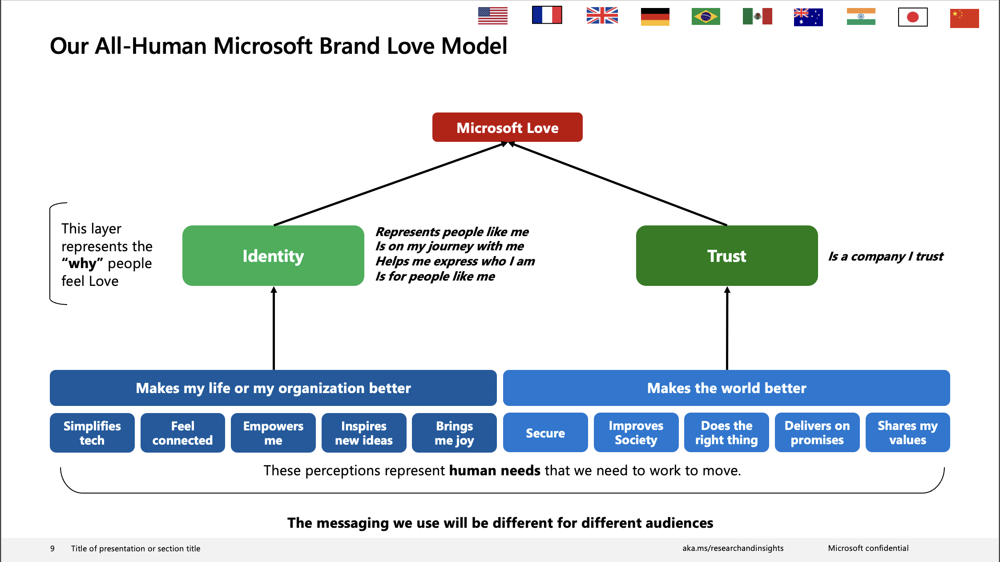

# Step 8: Brand Love Emotion States {#step-eight}

As outlined in the introduction, Microsoft are pushing for peak and pit posts to be linked to their "Brand Love" framework: 

(\#fig:unnamed-chunk-1)Microsoft Brand Love Framework from the powerpoint 'All Human Emotionality References Deck All Audiences' ... catchy

This framework sees the concept of "Brand Love" being split into two distinct groups of "Emotion States", the first group contributing towards how a product or brand makes ones life better, and includes the concepts of:

* Simplifying tech
* Feeling connected
* Feeling empowered
* Being inspired
* Feeling joy

The second group contributes to a more holistic overview of the product or brand. Microsoft thinks of this as "making the world better" and includes concepts of:

* Security
* Improving society
* Doing the right thing
* Delivering on promises
* Sharing values with the user

These are all broad concepts that Microsoft will tweak based on their specific marketing purpose (i.e. different audiences), but we need to find the core make up of each Emotion State.

We have not yet built out a model or workflow for all 10 Emotion State classifications. But currently our implementation for the "making my life better" concepts involves using custom GPT-3.5 prompts for each of the emotion states. Despite the outcome of the analysis being *multilabel*, we achieve this by performing many binary classification models (i.e. "does the post contain the concept of simplifying tech" - "Yes" or "No"). Whilst this is not the most streamlined approach, initial trials showed trying true multilabel classification with a long and detailed prompt overwhelmed the model and produced incorrect classifications (determined by human evaluation).

> This section will continue to be updated during the current project as we iterate on our approach to classify all 10 emotion states.
